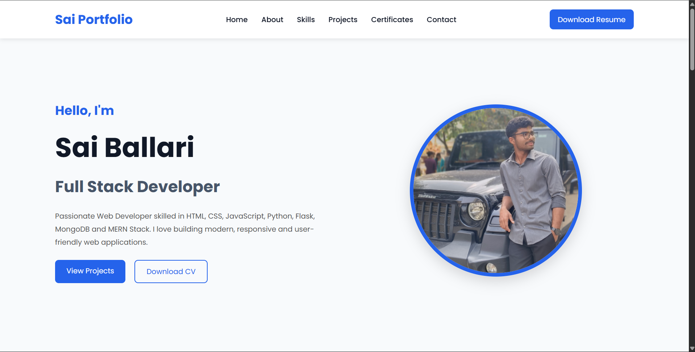
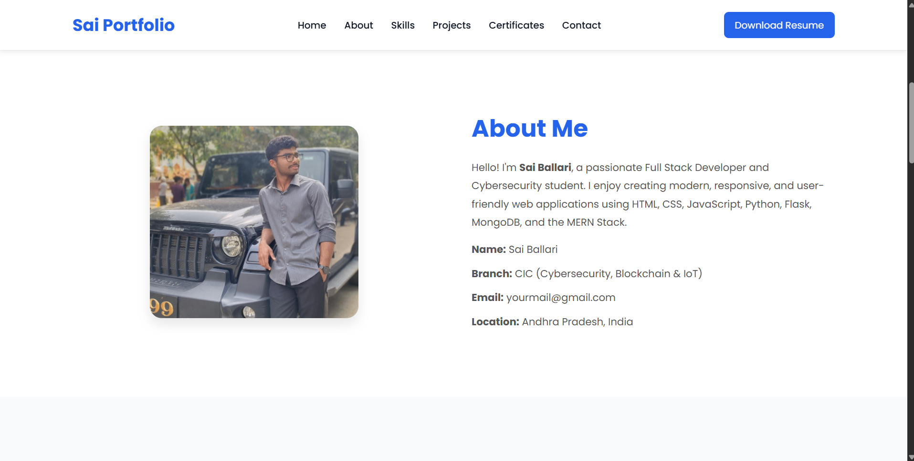
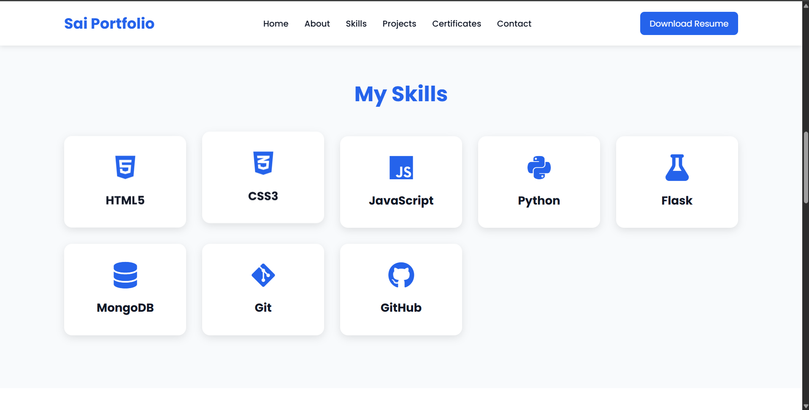
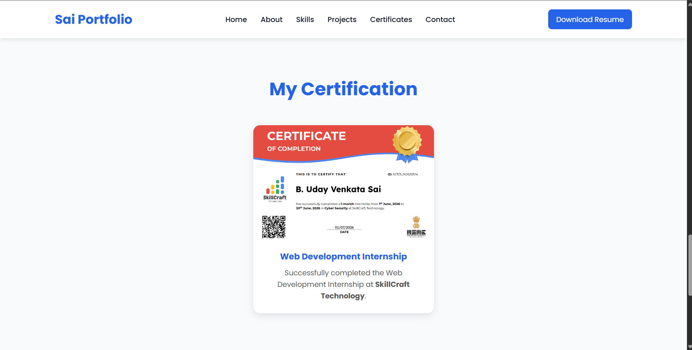
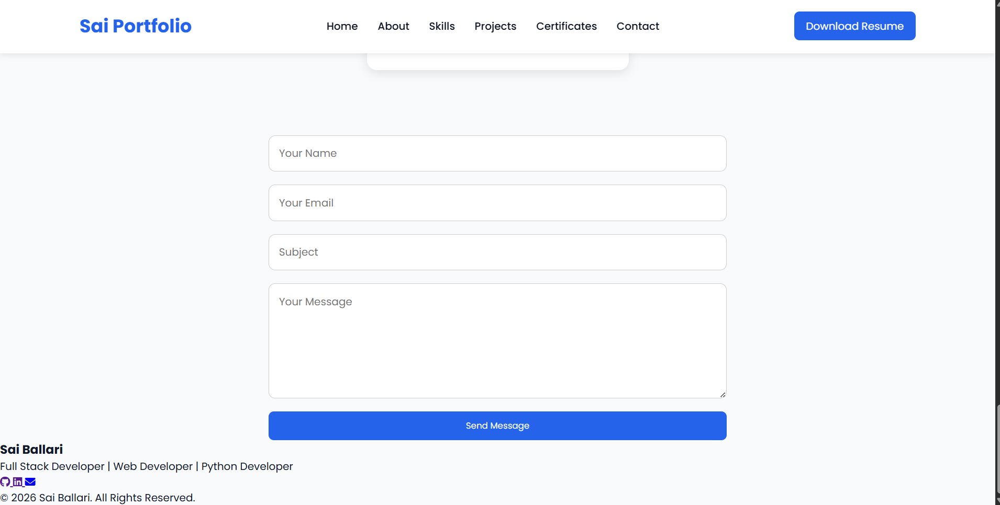

<div align="center">

# 🌐 Sai Ballari Portfolio Website

### 🚀 A Modern Full Stack Developer Portfolio Built with Flask

<p>
A professional, fully responsive portfolio website developed using <strong>Flask</strong>, <strong>HTML</strong>, <strong>CSS</strong>, and <strong>JavaScript</strong>. This portfolio showcases my projects, technical skills, certifications, achievements, and provides a seamless way to connect with me through an interactive and modern user interface.
</p>

<p>


</p>

### 🌍 Live Website

### **https://portfoilo-website-green.vercel.app/**

</div>

---

# 📖 About The Project

The **Sai Ballari Portfolio Website** is a responsive developer portfolio designed to professionally showcase my technical profile.

It highlights my:

* 👨‍💻 Technical Skills
* 🚀 Full Stack Projects
* 🔒 Cybersecurity Projects
* 📜 Certifications
* 📄 Resume
* 📬 Contact Information

The website focuses on modern UI design, responsive layouts, smooth navigation, and an engaging user experience.

---

# ✨ Features

* 🎨 Modern & Professional UI
* 📱 Fully Responsive Design
* ⚡ Smooth Scrolling Navigation
* 👨‍💻 About Me Section
* 💻 Skills Showcase
* 🚀 Projects Gallery
* 📜 Certifications Section
* 📄 Resume Download
* 📬 Contact Form
* ⚡ Flask Backend
* 🍃 MongoDB Database Integration
* 🎯 Interactive Hover Effects
* 🔥 Clean & Organized Layout

---

# 🛠️ Tech Stack

| Category        | Technologies            |
| --------------- | ----------------------- |
| Frontend        | HTML5, CSS3, JavaScript |
| Backend         | Python, Flask           |
| Database        | MongoDB                 |
| Deployment      | Vercel                  |
| Version Control | Git & GitHub            |

---

# 📂 Project Structure

```text
Portfolio/
│
├── frontend/
│   ├── index.html
│   ├── style.css
│   ├── script.js
│   └── assets/
│
├── backend/
│   ├── app.py
│   ├── database.py
│   ├── requirements.txt
│
├── screenshots/
│   ├── home.png
│   ├── about.png
│   ├── skills.png
│   ├── certificates.png
│   └── contact.png
│
└── README.md
```

---

# 📸 Project Preview

## 🏠 Home Page



---

## 👨 About Section



---

## 💻 Skills Section



---

## 📜 Certificates Section



---

## 📬 Contact Section



---

# 🚀 Installation

## Clone Repository

```bash
git clone https://github.com/saiballari/Portfolio.git
```

---

## Navigate to Project

```bash
cd Portfolio
```

---

## Install Dependencies

```bash
pip install -r backend/requirements.txt
```

---

## Run Flask Server

```bash
python backend/app.py
```

---

## Open Frontend

Open **frontend/index.html** using your browser or VS Code Live Server.

---

# 🎯 Key Highlights

✅ Professional Portfolio Design

✅ Flask Backend Integration

✅ MongoDB Database Integration

✅ Responsive Across Devices

✅ Modern User Interface

✅ Interactive Contact Form

✅ Live Deployment using Vercel

---

# 📚 Learning Outcomes

This project helped me gain practical experience in:

* Full Stack Web Development
* Flask Framework
* MongoDB Integration
* Responsive Web Design
* Frontend & Backend Integration
* Git & GitHub Workflow
* Vercel Deployment
* Professional Portfolio Development
* Clean Project Architecture

---

# 🚀 Future Enhancements

* 🔐 User Authentication
* 🌙 Dark / Light Mode
* 📊 Visitor Analytics Dashboard
* 💬 AI Chat Assistant
* 📧 Email Notifications
* 🌍 Custom Domain
* 📱 Progressive Web App (PWA)

---

# 👨‍💻 Developer

## **Sai Ballari**

**Full Stack Web Developer | Cybersecurity Enthusiast | Java Programmer**

---

# 🔗 Connect With Me

### 🌐 Portfolio

https://portfoilo-website-green.vercel.app/

### 💻 GitHub

https://github.com/saiballari

### 💼 LinkedIn

https://www.linkedin.com/in/venkata-sai-ballari-6a9737398/

### 📧 Email

[ballarisai10@gmail.com](mailto:ballarisai10@gmail.com)

---

# 🙏 Acknowledgements

This portfolio was developed to showcase my technical journey, projects, and skills in **Full Stack Web Development** and **Cybersecurity**. It reflects my passion for building responsive web applications and continuously learning modern technologies.

---

# ⭐ Support

If you found this project useful,

⭐ Star this repository

🍴 Fork this repository

📢 Share it with others

---

<div align="center">

### ⭐ Thank you for visiting this repository!

**If you like this project, don't forget to leave a ⭐ on GitHub.**

Made with ❤️ by **Sai Ballari**

</div>
